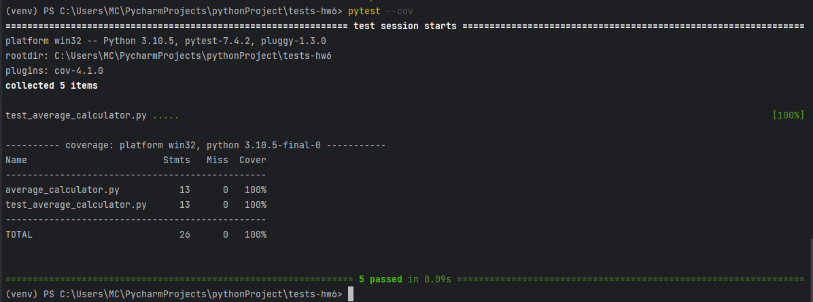

При использовании pylint, отчёт о покрытии тестами не генерируется. Pylint — это инструмент для статического анализа кода на Python, который проверяет соответствие написанного кода определенным стандартам и выдаёт предупреждения и рекомендации по улучшению качества кода.

Если вам нужен отчет о покрытии кода тестами, то можно использовать другой инструмент, такой как pytest-cov. Вот как можно использовать pytest-cov для генерации отчета о покрытии:

Установите pytest-cov:
pip install pytest-cov
Запустите ваши тесты с параметром --cov и указанием папки, которую нужно покрыть (например, --cov=my_module). Например:
pytest --cov=my_module tests/
После выполнения команды, pytest-cov соберет информацию о покрытии и выведет отчет в консоль.
